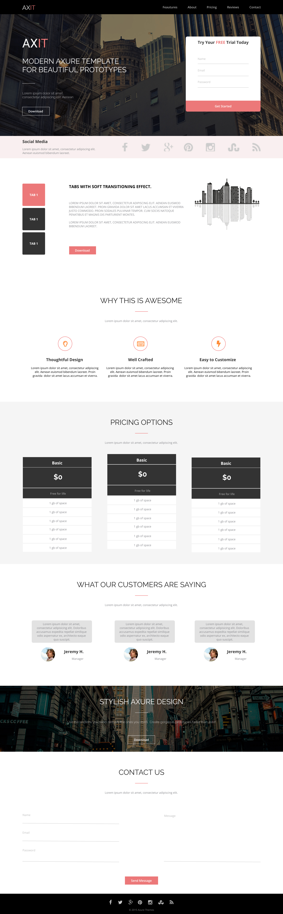

# AXIT

## 🚀 Project Description
**AXIT** is a modern, responsive one-page prototype template built with React and SCSS—perfect for showcasing beautiful designs and interactive UI patterns. It lets you:

- Showcase a full-screen hero header with background imagery and a signup form   
- Highlight key features with custom iconography and concise copy  
- Display pricing options side-by-side in a clean card layout  
- Collect customer feedback via a testimonial slider  
- Include a “Contact Us” form section for lead capture  
- Offer footer social links and a dropdown menu for mobile navigation  

Built to demonstrate best practices in component-driven UI development, AXIT is a great starting point for landing-page prototypes or production sites.

---

## 🔗 Live Demo

[View the live demo on GitHub Pages](https://taracamary.github.io/axit-site/)

---

## 🛠️ Technologies Used

- **React** (via Create React App)  
- **SCSS** for modular, maintainable styling  
- **CSS Flexbox & Grid** for flexible layouts  
- **Semantic Class Naming** by BEM-style conventions for clear, maintainable markup 
- **React-Burger-Menu** for the collapsible sidebar  
- **Font Awesome** for crisp, scalable icons  
- **Babel** for modern JavaScript transpilation   
- **npm** package management

---

## 📸 Screenshot

---

## 🚀 Quick Start

- To install `node_modules` run `npm install`.
- To run project in dev mode run `npm start`.
- To create production build run `npm run build`.
- Link to the website `http://localhost:3000/`.
